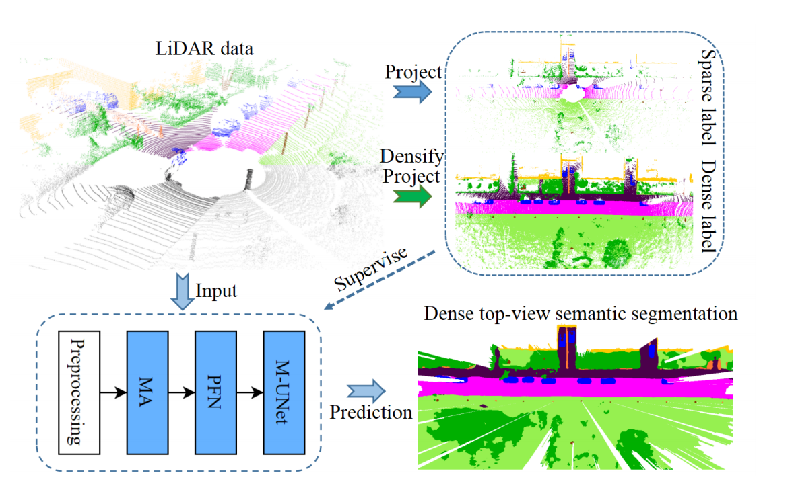

# MASS: Multi-Attentional Semantic Segmentation of LiDAR Data for Dense Top-View Understanding

We are aiming at recovering dense top-view semantic segmentation based on sparse LiDAR signal input. Our code is built based on OpenPCDet repo https://github.com/open-mmlab/OpenPCDet.git.
# OpenPCDet

`OpenPCDet` is a clear, simple, self-contained open source project for LiDAR-based 3D object detection.

It is also the official code release of [`[PointRCNN]`](https://arxiv.org/abs/1812.04244), [`[Part-A^2 net]`](https://arxiv.org/abs/1907.03670) and [`[PV-RCNN]`](https://arxiv.org/abs/1912.13192). 


## Introduction


## Label Densification

The tools for generating dense top-view label through multi-scene aggregating and top-view projection is in label processing tools. The lidaeseg_annotools.py maps nuScenes classes to desired class index in MASS. Then lidar_seg_label_cating.py will concate the semantic segmentation label for each LiDAR point. ego.py is leveraged for multi-frame lidar densification using the ego pose given by nuScenes. gt_img.py gives the color map and visualize the prediction/label.

## Visibility Map Generation

Code is in voxelize folder, please run cmake first to build it and use dense.cpp to generate the visibility map. Thanks to https://github.com/peiyunh/wysiwyg.git.

## Branches

Master branch is currently set up for nuScenes dataset. Config file can be found in tools/cfgs/nuscenes_models/cbgs_pp_multihead.yaml, please follow the guidance of OpenPCDet to run the code.
## Installation

Please refer to [INSTALL.md](docs/INSTALL.md) for the installation of `OpenPCDet`.


## Getting Started

Please refer to [GETTING_STARTED.md](docs/GETTING_STARTED.md) to learn more usage about this project.


## License

`MASS` is released under the [Apache 2.0 license](LICENSE).

## Acknowledgement
`MASS` is an open source project for dense top-view semantic segmentation based on LiDAR input. We would thanks https://github.com/open-mmlab/OpenPCDet.git for the great baseline.


## Citation 
If you find this project useful in your research, please consider cite:


```
@article{peng2021mass,
  title={MASS: Multi-Attentional Semantic Segmentation of LiDAR Data for Dense Top-View Understanding},
  author={Peng, Kunyu and Fei, Juncong and Yang, Kailun and Roitberg, Alina and Zhang, Jiaming and Bieder, Frank and Heidenreich, Philipp and Stiller, Christoph and Stiefelhagen, Rainer},
  journal={arXiv preprint arXiv:2107.00346},
  year={2021}
}
```

## Contribution
Welcome to be a member of the OpenPCDet development team by contributing to this repo, and feel free to contact us for any potential contributions. 


